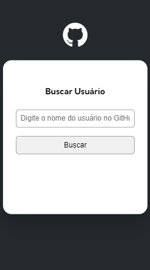

<h1 align="center"> Projeto API GitHub  </h1>

Esse projeto é um desafio proposto pelo curso DevQuest para aprimorar os meus conhecimentos nas tecnologias WEB.  

  <a href="#-visão-geral">Visão Geral</a>&nbsp;&nbsp;&nbsp;|&nbsp;&nbsp;&nbsp;
  <a href="#-projeto">Projeto</a>&nbsp;&nbsp;&nbsp;|&nbsp;&nbsp;&nbsp;
  <a href="#-tecnologias">Tecnologias</a>&nbsp;&nbsp;&nbsp;

 

## 👀 Visão Geral

- Desktop
    

    
    

- Mobile
    

    
    

 

## 💻 Projeto

O projeto utiliza a API do GitHub e tem como objetivo buscar um usuário do GitHub.

Temos alguns dados do usuário:
- Foto
- Nome
- Bio
- Quantidade de seguidores
- Acesso aos repositórios
- Eventos

 

---
[Visite o projeto online](https://lorena-avelino.github.io/projeto-gitHub-api/)

 

## 🚀 Tecnologias

Esse projeto foi desenvolvido com as seguintes tecnologias:

- HTML
- CSS
- JavaScript

